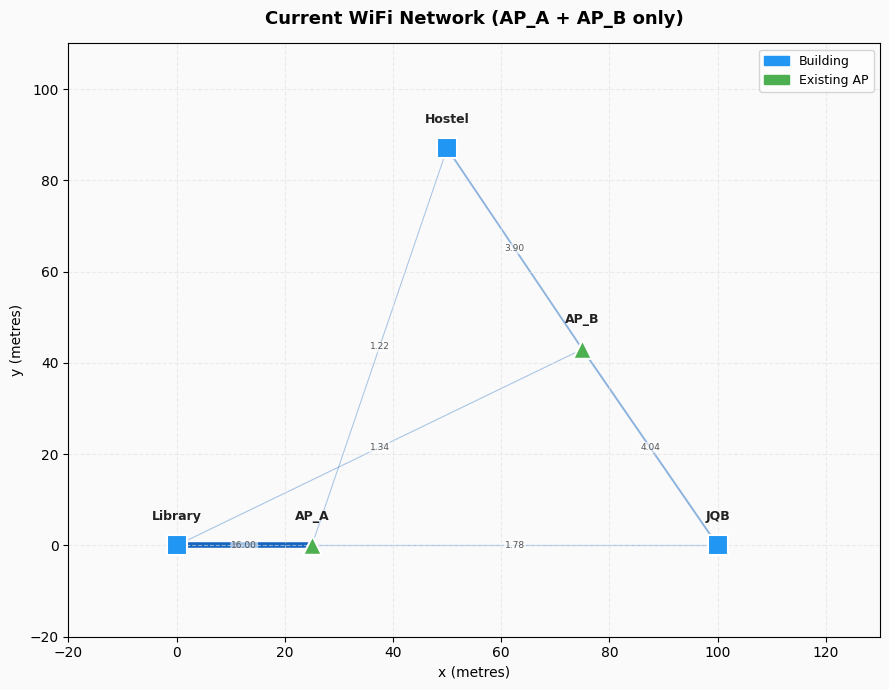

# 📡 WiFi Optimization

> **Optimising wireless access point placement using Graph Theory and Linear Algebra**

[](https://python.org)
[](LICENSE)
[](tests/)
[](notebooks/wifi_optimization_demo.ipynb)

---

## Overview

This project models a WiFi network as a **weighted graph** and uses **linear algebra** — specifically the eigenspectrum of the graph Laplacian — to find the optimal location for a new access point.

The key insight is that the **Fiedler value** ($\lambda_2$, the second-smallest eigenvalue of the Laplacian matrix $L = D - A$) measures the algebraic connectivity of the network. We test candidate AP locations and select the one that **maximises $\lambda_2$**, giving the most robustly connected network.

$$\lambda_2 \uparrow \implies \text{network is harder to disconnect} \implies \text{better WiFi coverage}$$

---

## 🏛️ The Scenario

A mini-campus with three buildings and two existing access points. Should we add a third AP? Where should it go?



**Answer:** Yes — adding AP_C at (50, 0) improves algebraic connectivity by **~26%** ($\lambda_2$: 4.85 → 6.12).

---

## 📐 Mathematical Pipeline

```
Campus Coordinates
       │
       ▼
Euclidean Distances  d = √[(x₂-x₁)² + (y₂-y₁)²]
       │
       ▼
Signal Strengths     S = S₀ / d²   (inverse square law)
       │
       ▼
Adjacency Matrix A   (n×n, weighted, bipartite)
       │
       ▼
Degree Matrix D      D[i,i] = Σⱼ A[i,j]
       │
       ▼
Laplacian  L = D - A
       │
       ▼
Eigenvalues of L     λ₁ ≤ λ₂ ≤ ... ≤ λₙ
       │
       ▼
Fiedler Value λ₂     ← connectivity metric
       │
       ▼
Maximise λ₂          ← optimal AP placement
```

---

## 📁 Project Structure

```
WiFi-Optimization/
├── README.md
├── LICENSE
├── CONTRIBUTORS.md
├── requirements.txt
├── setup.py
│
├── wifi_optimization/           ← Python package
│   ├── __init__.py
│   ├── distances.py             ← Adwoa Pokua
│   ├── matrices.py              ← Kwakye Ishmael
│   ├── spectral.py              ← Kwame Adjei Amoah
│   ├── optimizer.py             ← Kofi Sintim
│   └── visualizer.py           ← Melchi
│
├── notebooks/
│   └── wifi_optimization_demo.ipynb   ← Full walkthrough
│
└── tests/
    └── test_all.py              ← pytest test suite
```

---

## 🚀 Getting Started

### 1. Clone the repository

```bash
git clone https://github.com/calyxish/WiFi-Optimization.git
cd WiFi-Optimization
```

### 2. Create and activate a virtual environment (recommended)

Windows (PowerShell):

```bash
python -m venv .venv
.venv\Scripts\Activate.ps1
```

macOS/Linux:

```bash
python3 -m venv .venv
source .venv/bin/activate
```

### 3. Install dependencies

```bash
pip install -r requirements.txt
```

### 4. Run the notebook

```bash
jupyter notebook notebooks/wifi_optimization_demo.ipynb
```

### 5. Or use the package directly

```python
from wifi_optimization.distances import build_signal_matrix
from wifi_optimization.matrices import build_adjacency_matrix, build_laplacian
from wifi_optimization.spectral import fiedler_value, connectivity_report
from wifi_optimization.optimizer import find_best_placement

buildings = {
    'Library': (0, 0),
    'JQB':     (100, 0),
    'Hostel':  (50, 87),
}

existing_aps = {
    'AP_A': (25, 0),
    'AP_B': (75, 43),
}

candidates = {
    'AP_C': (50, 0),
    'AP_D': (25, 43),
}

best_ap, results = find_best_placement(buildings, existing_aps, candidates)
print(f"Best placement: {best_ap}")
```

### 6. Run the tests

```bash
pytest tests/ -v
```

---

## 📊 Key Results

| Configuration | Fiedler Value λ₂ | Improvement |
|---------------|-----------------|-------------|
| AP_A + AP_B (baseline) | 4.85 | — |
| + AP_C at (50, 0) | 6.12 | **+26.2%** |

---

## 🧮 Key Concepts

### Graph Laplacian
$$L = D - A$$

Where $A$ is the weighted adjacency matrix and $D$ is the diagonal degree matrix ($D_{ii} = \sum_j A_{ij}$).

**Properties:**
- Symmetric: $L = L^T$
- Positive semi-definite: all $\lambda_i \geq 0$
- Row sums = 0: $L\mathbf{1} = \mathbf{0}$
- $\lambda_1 = 0$ always

### Fiedler Value (Algebraic Connectivity)
The second-smallest eigenvalue $\lambda_2$ of $L$:
- $\lambda_2 = 0$ → graph is disconnected
- $\lambda_2 > 0$ → graph is connected
- Larger $\lambda_2$ → more robust connectivity

### Bipartite Graph Structure
Buildings never connect directly to each other — only to APs:
$$A = \begin{bmatrix} 0 & S \\ S^T & 0 \end{bmatrix}$$

---

## 🤝 Contributing

Contributions are welcome! See [CONTRIBUTORS.md](CONTRIBUTORS.md) for the team and contribution guidelines.

1. Fork the repo
2. Create a feature branch: `git checkout -b feature/your-idea`
3. Add tests for any new functionality
4. Open a Pull Request

---

## 📚 References

- Fiedler, M. (1973). *Algebraic connectivity of graphs.* Czechoslovak Mathematical Journal.
- Chung, F. R. K. (1997). *Spectral Graph Theory.* AMS.
- Diestel, R. (2017). *Graph Theory* (5th ed.). Springer.

---

## 📄 License

MIT © 2026 — Kwakye Ishmael, Kwame Adjei Amoah, Adwoa Pokua, Kofi Sintim, Melchi
